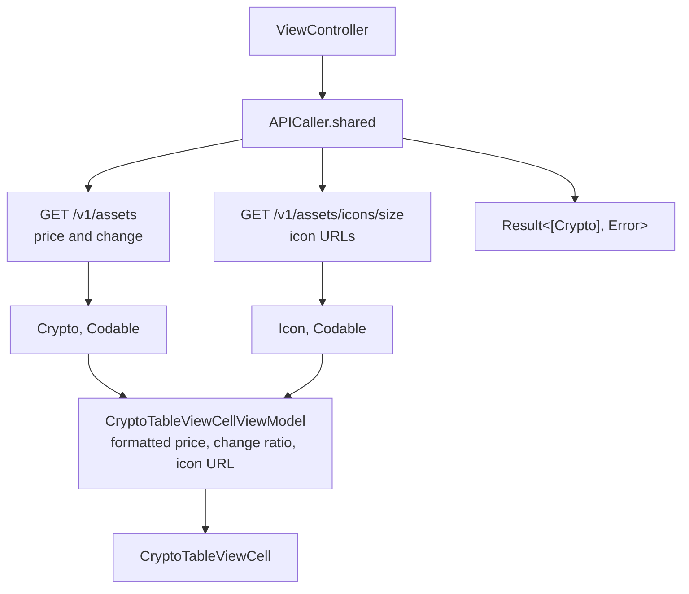

# Crypto Tracker

*A cryptocurrency list on the CoinAPI REST endpoints, with formatting isolated in a cell view model.*

    

## Overview

A scrolling list of assets with their current price and daily change. Two endpoints are involved: one
for the asset data and a second for the icon set, which must be resolved separately and matched by
asset identifier.

## Data flow



The icon endpoint takes a size placeholder in the path, so the URL is constructed rather than fixed.
The view model receives both models and produces exactly what the cell displays.

## Implementation notes

- **Result based completion.** `getAllCyrptoData` returns `Result<[Crypto], Error>`, so the caller
  handles both branches in one switch instead of checking an optional error.
- **Formatting outside the cell.** Currency formatting and percentage signs are decided in the view
  model, which keeps the cell to label assignment and makes the formatting testable.
- **Endpoint constants grouped.** URLs and the API key live in a private `Constants` struct inside the
  caller, so no string literals appear in the request code.
- **Reuse handled.** `prepareForReuse` clears the cell so a scrolled row never shows the previous
  asset while the new one loads.

## Project structure

```
CryptoTracker/
├── APICaller.swift     endpoints, request construction, decoding
├── Models.swift        Crypto, Icon
├── CryptoTableViewCell.swift   cell and its view model
└── ViewController.swift
```

## Requirements

Xcode 15 or later, iOS 17.5 or later. A CoinAPI key is required.
